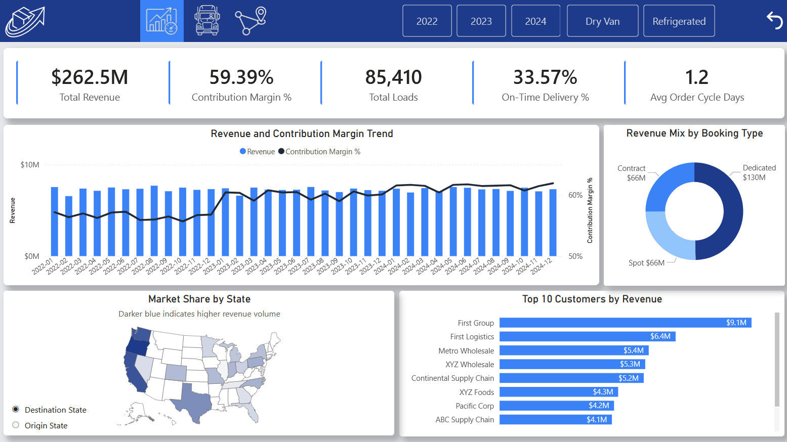
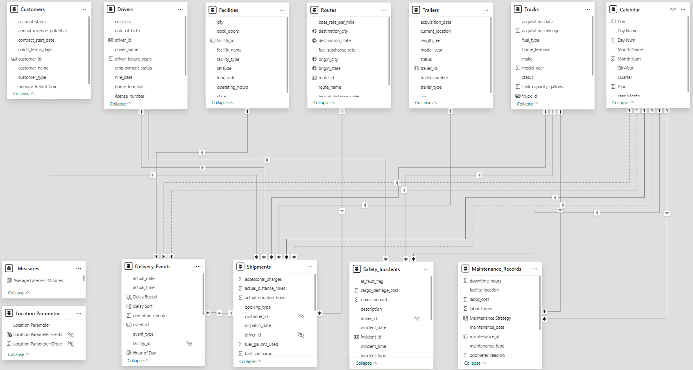
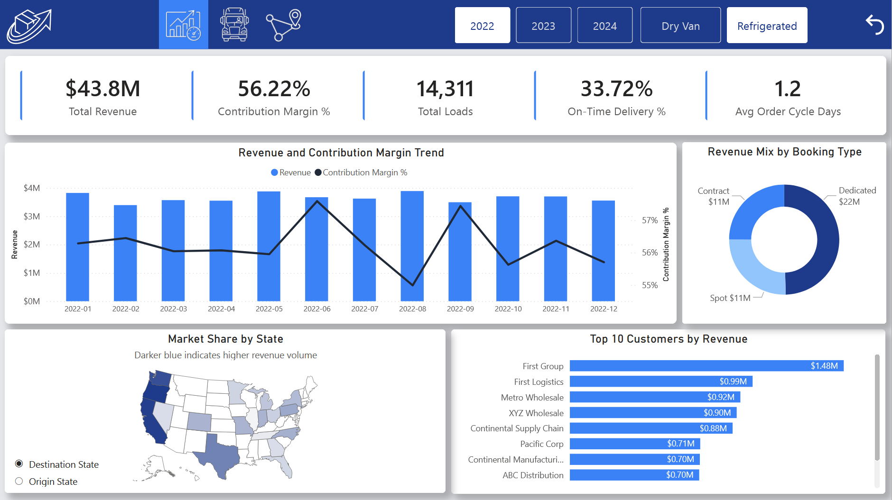
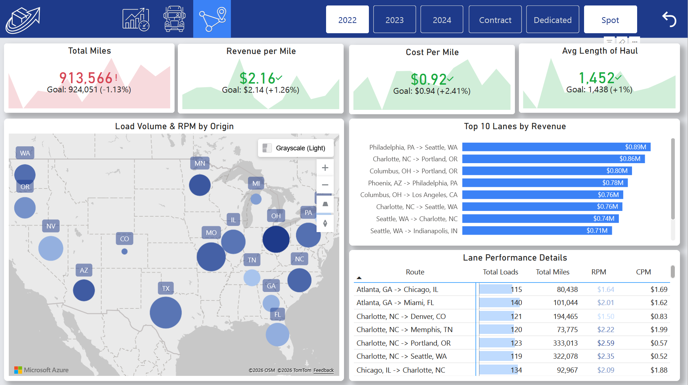
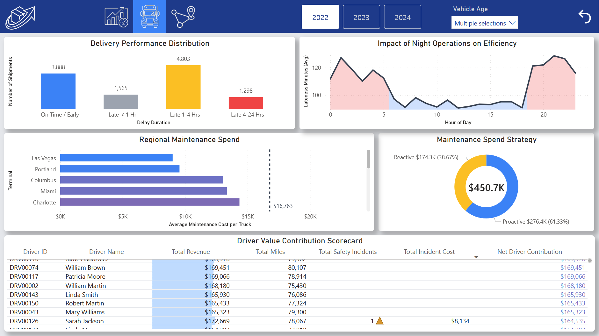

# Project: RapidLogi Executive Command Center

## 1. The Business Problem

### Context
RapidLogi operates a specialized fleet of 120 trucks and associated trailers across a complex logistics network. While the company captures detailed transactional data, it was historically fragmented across six distinct operational logs: `Loads`, `Trips`, `Fuel_Purchases`, `Delivery_Events`, `Safety_Incidents`, and `Maintenance_Records`. Because these tables operated in silos and at different levels of granularity, leadership lacked a unified view of the business. Data was rich but disconnected, leading to critical strategic blind spots.

### The Pain Points
* **The Fragmented Core (Revenue vs. Execution):** The most fundamental metric in logistics – net margin per trip – was impossible to calculate efficiently. Revenue data lived in the `Loads` table, physical dispatch data lived in the `Trips` table, and variable costs lived in a highly granular `Fuel_Purchases` ledger. Analysts had to perform heavy, manual “joins” just to see if a specific load was profitable.
* **The Disconnected Driver Scorecard:** Evaluating a driver’s true value was nearly impossible because their performance metrics lived in separate, unconnected domains:
  * Productivity (loads, revenue, miles) was buried across `Loads` and `Trips`.
  * Punctuality (on-time performance, delays) lived in `Delivery_Events`.
  * Risk Profile (accidents, violations) lived in `Safety_Incidents`.
* **The Hidden Cost of Operations:** While top-line revenue was tracked, critical expense data – specifically maintenance costs (from `Maintenance_Records`) and accident/claim costs (from `Safety_Incidents`) – were isolated from the revenue stream. The Pricing Team was often bidding on lanes without knowing if the maintenance and safety liabilities of the trucks servicing those lanes were eating up the margin.
* **Facility vs. Network Disconnect:** `Delivery_Events` (tracking arrival/departure times) was the only fact table directly linked to the `Facilities` dimension. However, it was not directly linked to `Drivers` or `Trucks`. This created a blind spot where the Operations Team could see that a facility had delays but could not easily trace those delays back to the specific equipment types or drivers involved.

### The Objective
To engineer a robust data pipeline and architect a centralized Power BI Executive Command Center. The goal was to:
* **Consolidate the Core (ETL):** Perform data transformation to merge `Loads` and `Trips` (1:1), and aggregate `Fuel_Purchases` to the trip-granularity level, creating a single, optimized `Shipments` mega-fact table.
* **Architect a Galaxy Schema:** Stitch the new `Shipments` table together with the remaining fact and dimension tables into a cohesive Fact Constellation (Galaxy) Schema.
* **Unify the Operations View:** Create a "360-degree" Driver Scorecard and integrate maintenance/safety costs into the financial view to determine the actual net margin of specific routes and customers.
* **Bridge the Schema Gaps:** Use the new `Shipments` table as a central connector to allow cross-filtering between customers, routes, facilities, assets, and drivers.

---

## 2. Technical Architecture & Data Modeling

### Phase 1: Data Engineering & ETL (Consolidating the Core)
Before building the analytical model, the raw operational data required significant transformation to resolve granularity mismatches and optimize query performance. The most critical step was engineering the `Shipments` mega-fact table.
* **1:1 Entity Merging:** The `Loads` (revenue and cargo data) and `Trips` (dispatch and physical movement data) tables existed at a 1:1 relationship. I merged these directly to flatten the hierarchy and reduce necessary “joins”.
* **Granularity Aggregation:** The `Fuel_Purchases` table existed at a highly granular, multi-transactional level. I aggregated this data up to the trip level (total fuel cost per trip).
* **The Output:** These three disparate sources were combined into a single, optimized `Shipments` fact table. This transformation instantly aligned revenue, operational execution, and variable costs into one unified row per shipment.

### Phase 2: The Fact Constellation (Galaxy) Schema
With the core shipment data consolidated, I architected a Fact Constellation Schema to handle the remaining distinct business processes. This complex model supports four fact tables operating at different grains, stitched together by seven conformed dimensions.

**The Dimension Tables (The Context):**
* `Calendar` (Universal Date Table)
* `Customers`, `Drivers`, `Routes`, `Trailers`, `Trucks`, `Facilities`

**The Fact Tables & Relationship Pathways (The Transactions):**
* **`Shipments` (The Anchor):** Related directly to all dimensions except Facilities. Acts as the primary financial and operational ledger.
* **`Delivery_Events` (The Facility Ledger):** Contains granular timestamps for facility arrivals and departures. This table sits on the "many" side of relationships with both the `Facilities` dimension and the `Shipments` mega-fact table. Crucially, the filter direction flows downstream from `Shipments` into `Delivery_Events`. This purposefully models the physical reality of the supply chain – a single shipment generates multiple sequential delivery events. This architecture ensures that when leadership filters the dashboard by a high-level dimension (like a specific Customer or Route), that filter seamlessly cascades through the `Shipments` table down to the `Delivery_Events` level, allowing analysts to instantly view the facility-level delays associated with those specific loads.
* **`Safety_Incidents` (The Risk Ledger):** Related directly to `Drivers` and `Trucks`.
* **`Maintenance_Records` (The Asset Ledger):** Related directly to `Trucks`.

### Phase 3: Navigating Cross-Domain Filter Context
By strictly defining these relationships, the model prevents false cross-filtering while enabling advanced analytical paths. For example, a user can select a specific Truck (Dimension) and simultaneously view its accumulated maintenance costs, the safety incidents and delivery performance associated with it, and the total revenue it generated – all correctly calculated without triggering bidirectional allocation traps.

---

## 3. UI/UX Strategy & Interface Design

### The Design Philosophy: "Software, Not Just Spreadsheets"
The primary goal for the RapidLogi Executive Command Center was to move away from the default, fragmented Power BI reporting experience and build an interface that feels like a premium, native web application. Executives require high-level, instantly readable insights with the ability to intuitively drill down without getting lost.

### i. App-Like Global Navigation
* **The Custom Header:** I replaced standard Power BI page tabs with a custom, full-width dark navy global header. This acts as the anchor for the entire application.
* **State-Based Page Tabs:** Navigation is handled via seamless, state-based buttons (*Executive Overview | Fleet Operations | Network Strategy*). The active page is highlighted, grounding the user and providing a predictable, guided experience across the three distinct business domains.

### ii. Contextual & Synced Filtering (The "Dark Mode" UI)
* **Universal vs. Local Context:** Universal filters, such as the Calendar Year, are placed in the global header and synced across all pages. However, secondary slicers are strictly tailored to the specific persona of the active page (e.g., a Vehicle Age dropdown for Operations Managers, and a Booking Type selector for Network Planners).
* **Inverted Slicer Design:** To ensure the slicers felt native to the dark header, I engineered custom "Dark Mode" formatting – utilizing transparent backgrounds, light gray text and 1px borders. This prevents the jarring white boxes that typically clutter Power BI interfaces.

### iii. Maximizing Canvas Real Estate & Interaction
* **Field Parameters for Geographic Toggling:** On the *Executive Overview* page, canvas space is at a premium. Instead of building two separate maps, I utilized DAX Field Parameters to create a single, clean toggle switch ([Origin] / [Destination]). This allows the user to instantly swap the geographical context of the Market Share by State map without leaving the page.
* **Visuals as Interactive Filters:** To reduce slicer fatigue, core visuals were designed to act as intuitive navigation tools. For example, the Regional Maintenance Spend bar chart on the *Fleet Operations* page is specifically configured to cross-filter (rather than highlight) the surrounding Delivery Performance Distribution and Maintenance Spend Strategy visuals, allowing an Operations Manager to instantly isolate a specific facility's performance with a single click.

---

## 4. Key Insights & Business Value Unlocked
By breaking down data silos and unifying RapidLogi’s operations into a single cohesive Fact Constellation schema, the Executive Command Center transitions the company from reactive reporting to proactive strategy. The tool immediately unlocked several high-value business insights:

### i. Variable Cost Profiling & True Contribution Margin
* **The Insight:** Prior to this model, lane profitability was evaluated solely on top-line revenue versus fuel cost. By integrating `Maintenance_Records` and `Safety_Incidents` into the financial stream, the dashboard calculates a highly accurate Contribution Margin.
* **The Business Value:** While the data does not account for fixed overhead (e.g., facility leases, employee wages, truck rentals), capturing the fully burdened variable costs allows the Pricing Team to see if specific lanes or asset types are bleeding cash through accelerated wear-and-tear or high claim rates.

### ii. Diagnosing the On-Time Delivery (OTD) Bottleneck
* **The Insight:** The dashboard revealed a historically low overall OTD rate of 33.57%. However, by engineering DAX calculated columns (`Delay Bucket`, `Lateness Minutes`, and `Hour of Day`) directly within the `Delivery_Events` table based on scheduled versus actual timestamps, the data exposed that the vast majority of these delays were not catastrophic but fell into a specific "1-4 hours late" bucket.
* **The Business Value:** The analysis proved a direct correlation between these micro-delays and night-time operations (7:00 pm – 5:00 am). Instead of broadly penalizing drivers, Operations leadership can now use this data to strategically adjust dispatch scheduling practices and optimize night-shift facility staffing to clear the bottleneck.

### iii. The 360-Degree Driver Scorecard (Operations & Safety)
* **The Insight:** Management can finally view a driver's holistic value. The dashboard cross-references a driver's gross revenue generation (Productivity) with their facility dwell times (Punctuality) and accident frequency (Risk).
* **The Business Value:** Operations can confidently distinguish between a "high-revenue" driver who achieves numbers by risking equipment, versus a truly elite operator who maximizes margin while protecting physical assets.

### iv. Asset Lifecycle & Capital Expenditure (Fleet Management)
* **The Insight:** By combining the `Trucks` dimension with `Maintenance_Records` and `Delivery_Events`, the Operations page precisely isolates how Vehicle Age impacts network flow.
* **The Business Value:** Fleet Managers can pinpoint the exact age threshold where preventative maintenance costs outpace depreciation benefits, instantly seeing how many late deliveries are directly correlated to older trucks breaking down. This provides data-backed justification for CapEx budget requests.

---

## Appendix: Data Source & Methodology
* **Raw Data Source:** The foundational dataset used to build this project was sourced from the Logistics Operations Database on Kaggle.
* **Project Scope:** While the raw transactional logs and dimension contexts were provided by the dataset, the data architecture, ETL pipeline, DAX measure engineering, UI/UX design, and the "RapidLogi" business narrative were custom-developed to simulate an enterprise-grade Business Intelligence deployment.
